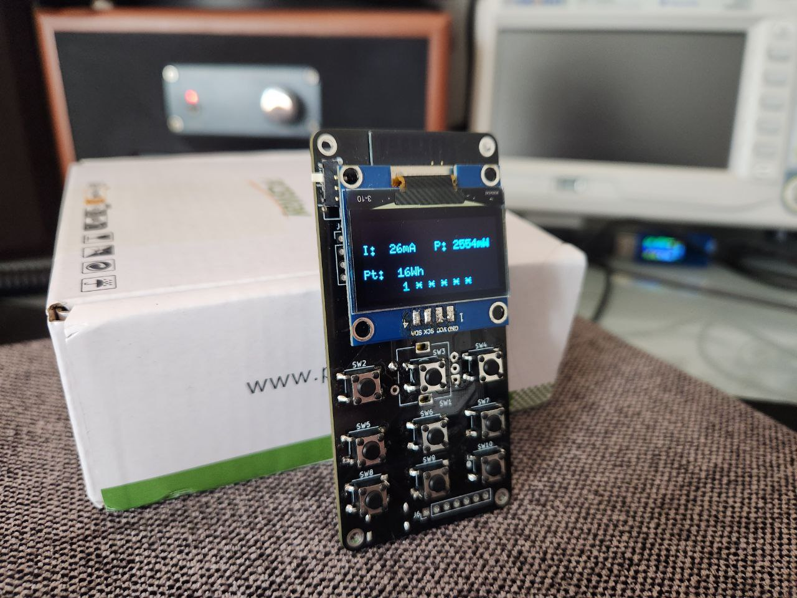

# Kasa-remote

An ESP32 based remote control device for manipulating and monitoring TPLink Kasa devices.

Future plans include new control modules, power saving, and other nice-to-haves. 

Leverages [rust_kasa](https://github.com/Paumanok/rust_kasa)
